## Title: Analyzing Prefetchers

|        | Detail |
| ------ | ------ |
| Name   | Shaheen Eshghi & Vinh     |
| SFU ID | 301305148 & 301449797     |
| Email  | seshghie@sfu.ca & qvd@sfu.ca     |

## Task 1. L1 vs L2 Prefetching

### Q1. How much does execution time improve if prefetching implemented at L1 vs L2. Why? 

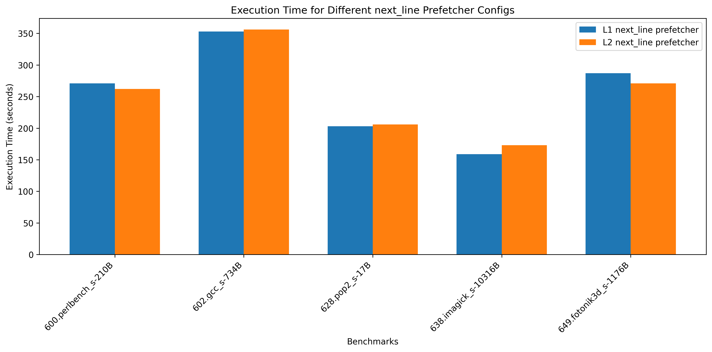

- "600.perlbench_s-210B.champsimtrace.xz": With a single next_line prefetcher implemented on L1 we yield 271 second execution time, while with a single next_line prefetcher implemented on L2 we yield 262 second execution time.
- "602.gcc_s-734B.champsimtrace.xz": With a single next_line prefetcher implemented on L1 we yield 353 second execution time, while with a single next_line prefetcher implemented on L2 we yield 356 second execution time.
- "628.pop2_s-17B.champsimtrace.xz": With a single next_line prefetcher implemented on L1 we yield 203 second execution time, while with a single next_line prefetcher implemented on L2 we yield 206 second execution time.
- "638.imagick_s-10316B.champsimtrace.xz": With a single next_line prefetcher implemented on L1 we yield 159 second execution time, while with a single next_line prefetcher implemented on L2 we yield 173 second execution time.
- "649.fotonik3d_s-1176B.champsimtrace.xz": With a single next_line prefetcher implemented on L1 we yield 287 second execution time, while with a single next_line prefetcher implemented on L2 we yield 271 second execution time.

- The varying execution times observed across benchmarks is due to the nature of each benchmark's memory access patterns and the location of the prefetcher in the memory hierarchy. L1 prefetchers bring data closer to the CPU more quickly, leading to potentially faster data access if the prefetched data is immediately useful. This proximity can reduce cache misses in the L1 which improves execution time, as seen with the 638.imagick_s-10316B benchmark (159 second L1 prefetcher vs 173 second L2 prefetcher). However, because L1 cache is limited in size, aggressive prefetching can lead to cache pollution, where prefetched data replaces data that might still be relevant. This could deteriorate performance if the prefetched data isn't actually used, as seen in 602.gcc_s-734B 600.perlbench_s-210B and 649.fotonik3d_s-1176B benchmarks. Prefetching to L2 can be advantageous for workloads with larger and/or more sequential access patterns. L2 cache can hold more data than L1 which reduces the possibility of cache pollution and allows prefetched data to be readily available without displacing critical L1 cache lines. For instance, 600.perlbench_s-210B and 649.fotonik3d_s-1176B benchmarks yield improved execution times in this setup (262 & 271 second L2 prefetcher vs 271 & 287 second L1 prefetcher respectively). Benchmarks with smaller working sets or those sensitive to cache pollution may benefit from L2 prefetching, while benchmarks that frequently reuse nearby memory addresses may see better results with L1 prefetching.

### Q2. Did the useful and useless prefetches vary between the L1 prefetching vs L2 prefetching?

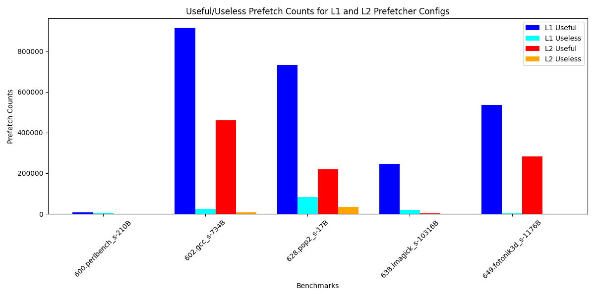

- "600.perlbench_s-210B.champsimtrace.xz": With a single next_line prefetcher implemented on L1 we yield 7334 useful and 6084 useless prefetches, while with a single next_line prefetcher implemented on L2 we yield 1133 useful and 43 useless prefetches.
- "602.gcc_s-734B.champsimtrace.xz": With a single next_line prefetcher implemented on L1 we yield 915999 useful and 25248 useless prefetches, while with a single next_line prefetcher implemented on L2 we yield 459695 useful and 8569 useless prefetches.
- "628.pop2_s-17B.champsimtrace.xz": With a single next_line prefetcher implemented on L1 we yield 734746 useful and 82713 useless prefetches, while with a single next_line prefetcher implemented on L2 we yield 219898 useful and 34174 useless prefetches.
- "638.imagick_s-10316B.champsimtrace.xz": With a single next_line prefetcher implemented on L1 we yield 246134 useful and 19459 useless prefetches, while with a single next_line prefetcher implemented on L2 we yield 3788 useful and 0 useless prefetches.
- "649.fotonik3d_s-1176B.champsimtrace.xz": With a single next_line prefetcher implemented on L1 we yield 536716 useful and 2960 useless prefetches, while with a single next_line prefetcher implemented on L2 we yield 282401 useful and 171 useless prefetches.

- L1 prefetching generally yields more useful prefetches than L2 due to its closer and more aggressive nature. The negative side is that this can lead to over-predicting and therefore more useless prefetches. L2 prefetching generates fewer overall prefetches but also yields a lower number of useless prefetches. This means it can be more accurate and selective. In conclusion, for benchmarks with repetitive or predictable memory patterns, L1 prefetching is more beneficial. For benchmarks where excessive prefetching can introduce inefficiencies, L2 prefetching would be a better choice.

## Task 2. Baseline strided prefetcher

### Q3. Vary PT size from 64,128,256,512,1024. How does it influence performance, prefetch accuracy?

- The L1 D-cache prefetch behavior varies significantly across benchmarks as the table size increases from 64 to 1024 bytes. Only **600.perlbench_s-210B** shows meaningful improvement, increasing from ~100 to ~300 useful prefetches. The other benchmarks maintain relatively constant performance despite larger table sizes: **602.gcc_s-734B** and **649.fotonik3d_s-1176B** sustain around \(10^5\) useful prefetches, while **628.pop2_s-17B** and **638.imagick_s-10316B** maintain around \(10^4\) useful prefetches. This suggests that for most applications, increasing the prefetch table size beyond 64 bytes offers diminishing returns, except for applications with memory access patterns similar to **600.perlbench_s-210B**. The high initial performance of most benchmarks at the smallest table size (64 bytes) indicates that a larger prefetch table may not justify the additional hardware complexity.

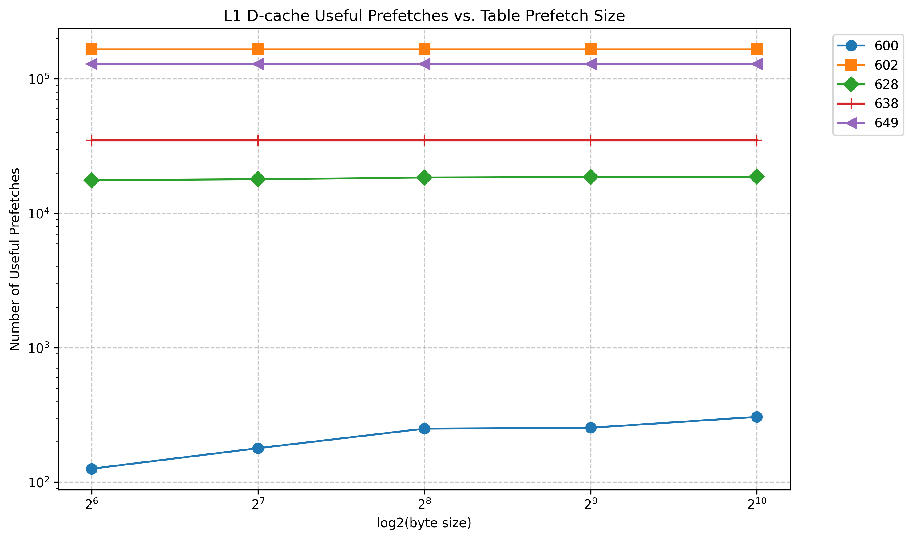

### Q4. Vary prefetch depth 
The impact of prefetch degree (from 2⁰ to 2⁴) on L1 D-cache useful prefetches shows several important patterns:
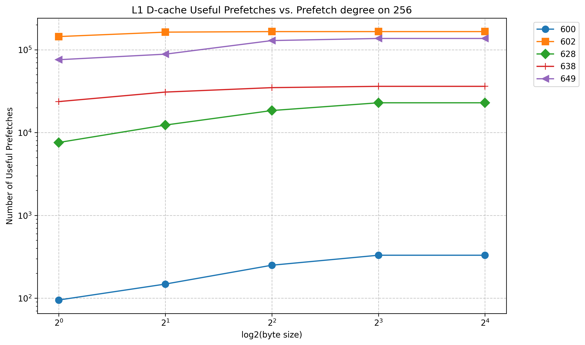

1. Initial Response: All benchmarks show improvement as the prefetch degree increases from 1 (2⁰), with the most dramatic improvements occurring between degrees 1-4 (2⁰-2²):
   - 628.pop2_s shows a significant jump from ~8,000 to ~20,000 useful prefetches
   - 649.fotonik3d_s increases from ~70,000 to ~150,000 useful prefetches
   - 600.perlbench_s, while starting lowest, shows consistent improvement from ~100 to ~300 prefetches

2. Saturation Point: Most benchmarks reach diminishing returns around degree 8 (2³):
   - The curves flatten noticeably between 2³ and 2⁴
   - 602.gcc_s, which maintains the highest performance (~150,000 prefetches), shows minimal improvement past degree 2

3. Performance Stratification: The benchmarks maintain clear performance tiers throughout:
   - High tier (10⁵): 602.gcc_s and 649.fotonik3d_s
   - Mid tier (10⁴): 628.pop2_s and 638.imagick_s
   - Low tier (10²): 600.perlbench_s

This suggests that a prefetch degree of 8 might be optimal for most applications, balancing hardware complexity with prefetch effectiveness.

### Q5. Plot histogram of strides ? Does it change over time?

- "600.perlbench_s-210B": Shows concentration around stride 0 with some spread and occasional large strides (±400). The mean (14.98) and median (1.50) indicate mostly small strides with some larger jumps, which explains the relatively low prefetch performance with only 7334 useful prefetches on L1.

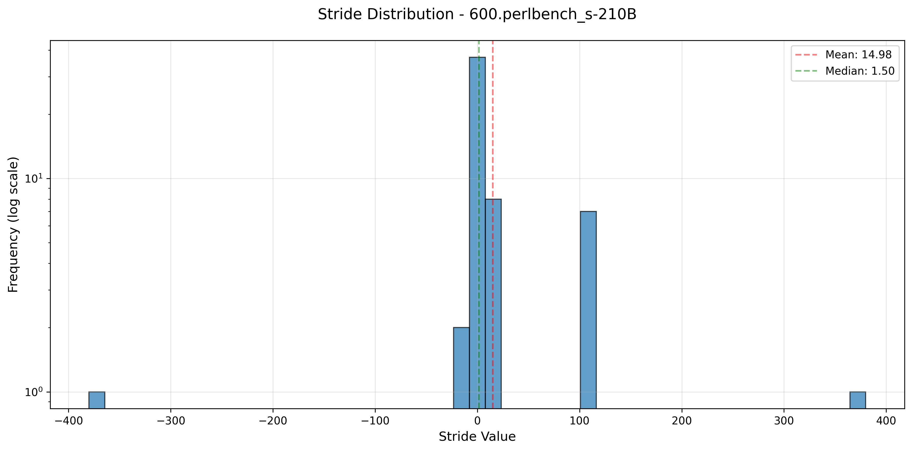

- "602.gcc_s-734B": Demonstrates the most diverse stride distribution, with multiple constant strides ranging from -3 to 3 and higher frequency around 0. This variety of predictable patterns explains its exceptional performance with 915999 useful prefetches on L1, as the prefetcher successfully learns and utilizes multiple consistent stride patterns.

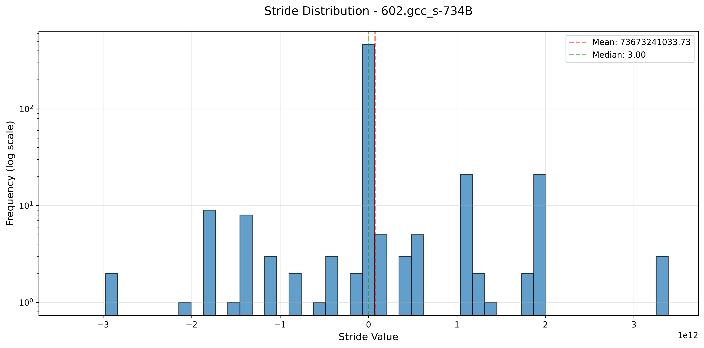

- "628.pop2_s-17B": Shows strong concentration at stride 0 with few occurrences at -1 and near 2e12. The median of 2.00 suggests mostly sequential access with some large jumps. This relatively consistent pattern results in good performance with 734746 useful prefetches on L1.

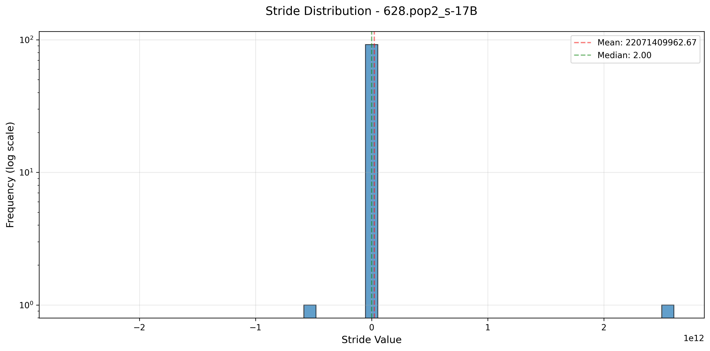

- "638.imagick_s-10316B": Exhibits very consistent pattern with most strides around value 1 and small occurrence at stride 3. The close mean (1.20) and median (1.00) values indicate highly predictable memory access patterns, leading to efficient prefetching with 246134 useful prefetches on L1 despite simpler patterns.

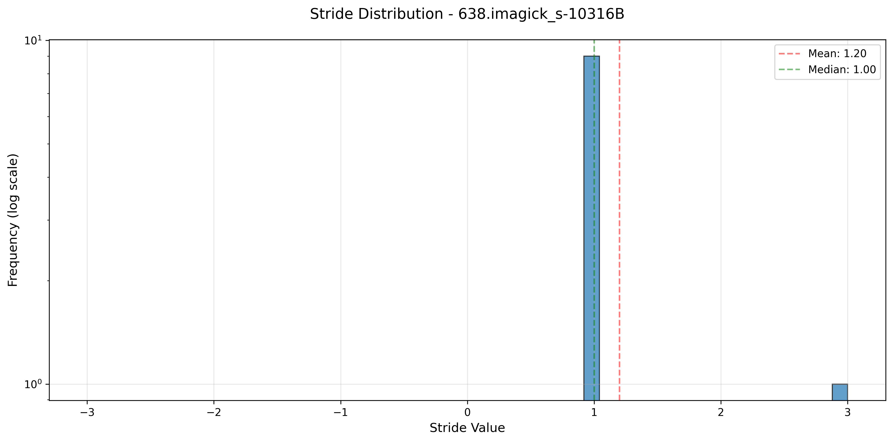

- "649.fotonik3d_s-1176B": Shows concentrated distribution around stride 0 with one small occurrence around -2.0. Despite the highly negative mean (-3319018417.16) due to outliers, the median of 1.00 indicates consistent small strides, resulting in good performance with 536716 useful prefetches on L1.

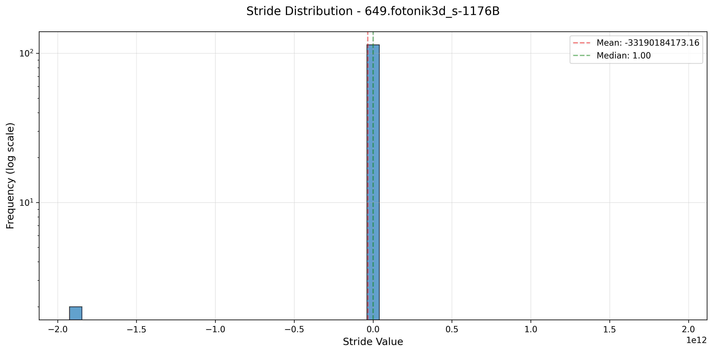

## Task 3. Global History Stride Prefetcher
   
### Q6. Compare strided prefetcher against Global history prefetcher 
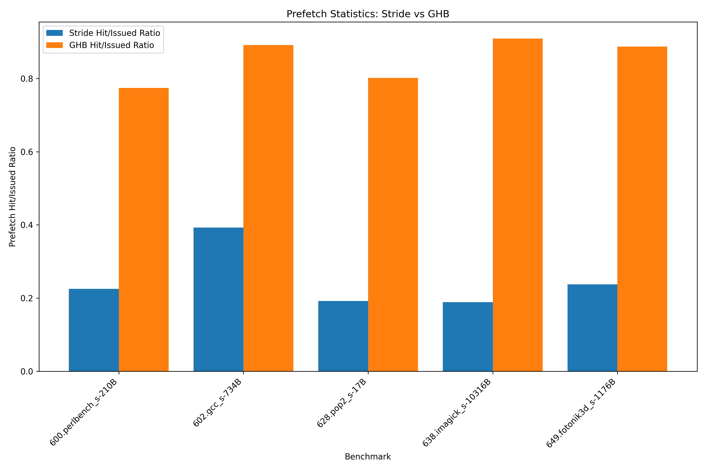
- We see that the GHB overall outperforms the stride constant, with some cases even having double the accuracy. This proves that GHB is a more effective prefetch technique compared to the stride constant. Additionally, the figure shows some interesting observations. The GHB hit/issued ratio is significantly higher than the Stride hit/issued ratio across all benchmarks, suggesting that the GHB prefetch technique is more efficient at correctly predicting memory accesses and issuing useful prefetch requests compared to the Stride technique. The performance gap between Stride and GHB also varies across the different benchmarks, with the difference in hit/issued ratios being largest for the "602.gcc_s-734B" benchmark and relatively smaller for the "649.fotonik3d_s-1176B" benchmark. 

### Q7 Increase prefetch depth 1-16 
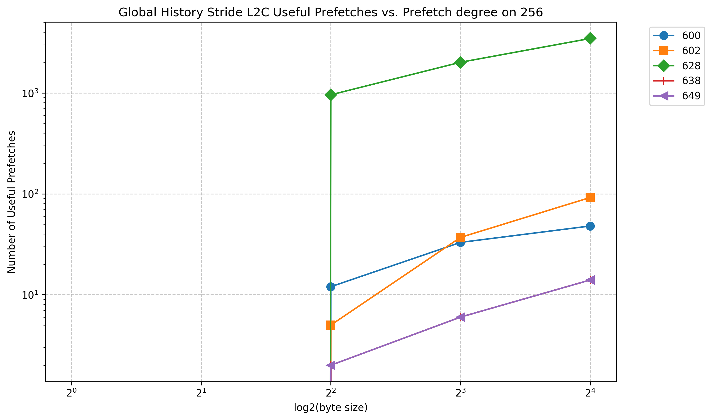
- Performance and prefetch accuracy are both measured by the number of useful prefetches below.
- "600.perlbench_s-210B.champsimtrace.xz": With prefetch depth of 1, we measured 0 useful prefetches. With prefetch depth of 2, we measured 0 useful prefetches. With prefetch depth of 4, we measured 12 useful prefetches. With prefetch depth of 8, we measured 33 useful prefetches. With prefetch depth of 16, we measured 48 useful prefetches.
- "602.gcc_s-734B.champsimtrace.xz": With prefetch depth of 1, we measured 0 useful prefetches. With prefetch depth of 2, we measured 0 useful prefetches. With prefetch depth of 4, we measured 5 useful prefetches. With prefetch depth of 8, we measured 37 useful prefetches. With prefetch depth of 16, we measured 92 useful prefetches.
- "628.pop2_s-17B.champsimtrace.xz": With prefetch depth of 1, we measured 0 useful prefetches. With prefetch depth of 2, we measured 0 useful prefetches. With prefetch depth of 4, we measured 958 useful prefetches. With prefetch depth of 8, we measured 2014 useful prefetches. With prefetch depth of 16, we measured 3467 useful prefetches.
- "638.imagick_s-10316B.champsimtrace.xz": With prefetch depth of 1, we measured 0 useful prefetches. With prefetch depth of 2, we measured 0 useful prefetches. With prefetch depth of 4, we measured 2 useful prefetches. With prefetch depth of 8, we measured 6 useful prefetches. With prefetch depth of 16, we measured 14 useful prefetches.
- "649.fotonik3d_s-1176B.champsimtrace.xz": With prefetch depth of 1, we measured 0 useful prefetches. With prefetch depth of 2, we measured 0 useful prefetches. With prefetch depth of 4, we measured 2 useful prefetches. With prefetch depth of 8, we measured 6 useful prefetches. With prefetch depth of 16, we measured 14 useful prefetches.

- Summary: "628.pop2_s-17B.champsimtrace.xz" has the highest increase, with a sharp rise in useful prefetches as the degree increases. Other benchmarks like "600.perlbench_s-210B.champsimtrace.xz" and "602.gcc_s-734B.champsimtrace.xz" show more modest improvements in useful prefetches with increasing degree. "638.imagick_s-10316B.champsimtrace.xz" shows negligible benefits from using the GHS prefetcher for any degree, so much so that it doesn't even register on the graph. "649.fotonik3d_s-1176B.champsimtrace.xz" shows the smallest increase, indicating that this benchmark may not benefit as significantly from higher prefetch degrees.

## Task 4. Feedback GHB 

### Q6. Compare feedback prefetcher gainst Global history prefetcher 

### Q7. Create histogram of prefetch depth in table? How many entries distance 4-8,8-12 etc. Compare against GHB with fixed degree 

### Q8. Plot the useless prefetches for GHB with 16 and 32 vs Feedback GHB. How does it impact performance?
